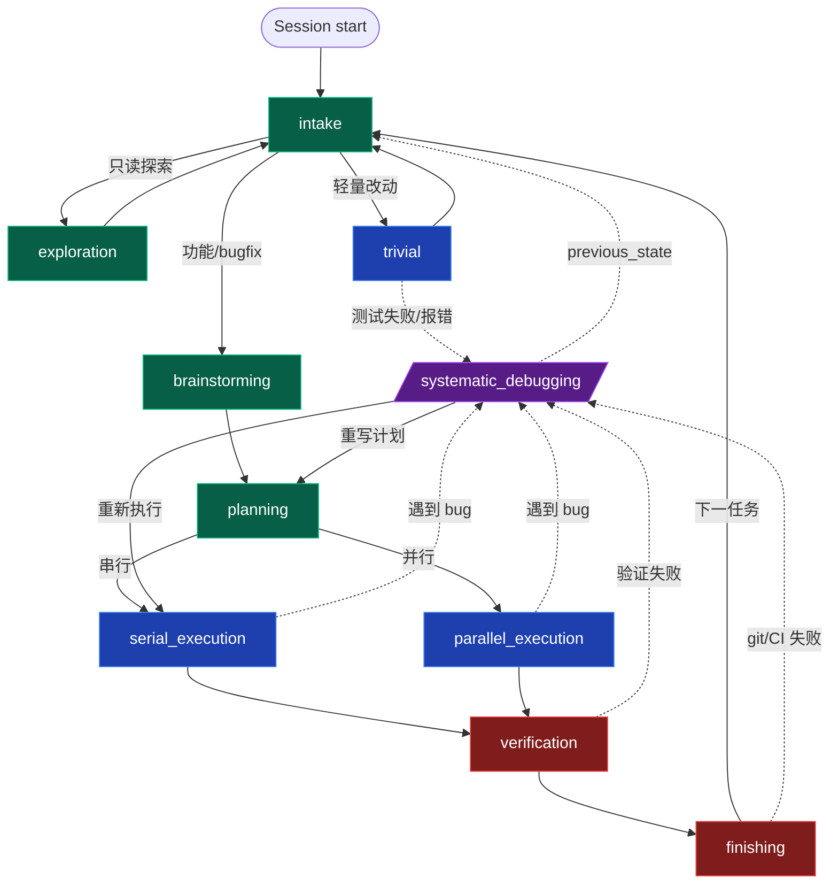

# Superharness

Superharness 是面向 AI 编程代理的程序化工作流运行时。它把“什么时候该做需求分析、什么时候该写计划、什么时候该执行、什么时候必须验证”从纯 prompt 纪律升级为可校验、可审计、可恢复的状态机。

核心能力：

- **状态机驱动的 active skills**：覆盖会话入口分流（intake）、只读探索、轻量改动、需求澄清、计划编写、串行/并行执行、TDD、系统化调试、代码审查、完成前验证、分支收尾、中文工程规范等开发环节。
- **程序化状态机**：默认工作流由 `workflow/default-workflow.yaml` 描述，状态切换通过 MCP 工具管理，而不是让 agent 直接改状态文件。
- **Hook 动态注入**：Claude Code / Codex 通过 `UserPromptSubmit` 注入当前工作流上下文。
- **状态保护**：`PreToolUse` 阻止直接写入 `.superharness/`，要求通过工作流状态工具完成状态变更。
- **双端支持**：Claude Code、Codex 都接入同一套 skills、状态机与上下文渲染机制。

## 架构

```text
用户请求
  -> Hook 注入当前工作流状态
  -> Agent 按 active skill 执行
  -> superharness-workflow-state MCP 管理状态跳转
  -> .superharness/ 持久化状态与审计事实
```

### 工作流状态机（v3）

每次会话都从 `intake` 开始，由它把请求分流到三条支线之一；执行支线结束后再回到 `intake` 等待下一任务。`systematic_debugging` 是抢占式分支，任何执行/验证/收尾节点失败都可以转入，调试完成后通过 `previous_state` 回边返回原状态：

`intake → exploration / trivial / (brainstorming → planning → serial_execution | parallel_execution → verification → finishing) → intake`



关键目录：

| 路径 | 说明 |
|---|---|
| `plugins/superharness/skills/` | 当前 active skills 目录 |
| `plugins/superharness/workflow/` | 默认工作流配置 |
| `plugins/superharness/workflow-state-server/` | 状态机 MCP 与渲染逻辑 |
| `plugins/superharness/hooks/` | Claude Code / Codex hook 配置与入口 |
| `plugins/superharness/archived-skills/` | 已归档、不可发现的历史 skill |

## 安装

### Claude Code

```text
/plugin marketplace add ShirlyTaylor73/superharness
/plugin install superharness@superharness
```

更新 / 卸载：

```text
/plugin update superharness
/plugin uninstall superharness
```

### Codex CLI

```bash
codex plugin marketplace add ShirlyTaylor73/superharness
```

然后启动 Codex，输入 `/plugins`，选择 `superharness` 安装。

更新 / 移除：

```bash
codex plugin marketplace upgrade superharness
codex plugin marketplace remove superharness
```

### 本地开发安装

```bash
git clone https://github.com/ShirlyTaylor73/superharness.git
cd superharness
```

Claude / Codex 推荐使用插件市场安装。若只想手动使用 skills，可把 `plugins/superharness/skills/` 复制或链接到目标工具的 skills 目录。

常见目标目录：

| 工具 | skills 目录 |
|---|---|
| Claude Code | `.claude/skills/` |
| Codex CLI | `.agents/skills/` |
| Gemini CLI | `.gemini/skills/` |
| Aider | `.aider/skills/` |
| Windsurf | `.windsurf/skills/` |
| OpenClaw | `skills/` |

## Active Skills

| Skill | 用途 |
|---|---|
| `intake` | 会话入口与请求 triage（分流到 exploration / trivial / brainstorming） |
| `exploration` | 只读深度探索，不写文件 |
| `trivial` | 单点轻量改动 + 自带验证 |
| `brainstorming` | 需求澄清与设计规格 |
| `planning` | 编写可执行实现计划 |
| `serial-execution` | 小计划串行执行 |
| `parallel-execution` | 大计划 wave 化并行执行 |
| `test-driven-development` | TDD 红绿重构 |
| `systematic-debugging` | 系统化定位和修复问题 |
| `requesting-code-review` | 请求代码审查 |
| `receiving-code-review` | 处理代码审查反馈 |
| `verification` | 完成前验证 |
| `finishing` | 开发分支收尾 |
| `dispatching-parallel-agents` | 非 plan 场景并行派发 |
| `using-git-worktrees` | 隔离式开发工作树 |
| `writing-skills` | 创建和改进 skills |
| `chinese-code-review` | 中文团队代码审查规范 |
| `chinese-git-workflow` | 国内 Git 平台工作流 |
| `chinese-documentation` | 中文技术文档规范 |
| `chinese-commit-conventions` | 中文提交规范 |
| `mcp-builder` | MCP 服务器构建方法论 |
| `workflow-runner` | 多角色 YAML 工作流执行 |

## 废弃机制

历史入口 skill `using-superpowers` 已归档到 `archived-skills/`，不再注册、不再注入、不再作为运行时入口。当前入口由 hook 注入的 workflow context 和 `superharness-workflow-state` MCP 接管。

## 验证

```bash
cd plugins/superharness/workflow-state-server
npm.cmd test
```

## License

MIT

