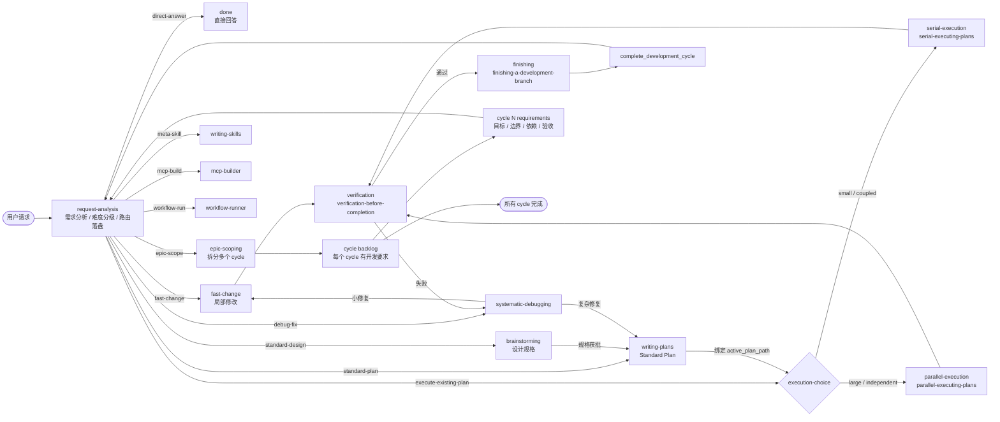

# 多 Skill 工作流状态转换图

## 核对结论

一期之后，`using-superpowers` 不再作为状态机入口路由使用。新的主路径由 hook 动态注入当前状态上下文，并通过 MCP 状态工具读取、分类、跳转和审计状态事实。

因此二期图中的入口不是 `using-superpowers`，而是程序化的 `request-analysis`：

- `request-analysis` 负责需求分析、难度分级、route 选择和状态落盘。
- `epic-scoping` 只拆分 `development_cycle` backlog，不写完整实现计划。
- 一个 `Standard Plan` 等于一个 active `development_cycle` 的详细开发周期。
- 横切 skill 仍按场景动态叠加，不作为默认 next state。

## Mermaid 状态转换图

## 状态与 Skill 映射

| 状态 / 场景 | 对应 skill 或机制 | 显式 next state | 辅助 skill |
|---|---|---|---|
| 需求分析 / 分流 | `request-analysis` | 按 route 进入后续状态 | 无 |
| 简单问答 | 无开发 skill | `done` | 无 |
| 简单小改 | fast-change guard | `verification` | `test-driven-development` 轻量 guard |
| 设计澄清 | `brainstorming` | `writing-plans` | `chinese-documentation` |
| Standard Plan | `writing-plans` | `execution-choice` | `chinese-documentation` |
| 串行执行 | `serial-executing-plans` | `verification` | `test-driven-development`, `requesting-code-review` |
| 并行执行 | `parallel-executing-plans` | `verification` | `test-driven-development`, `requesting-code-review` |
| 完成验证 | `verification-before-completion` | `finishing` 或 `systematic-debugging` | 无 |
| 收尾 | `finishing-a-development-branch` | `complete_development_cycle` | `chinese-git-workflow`, `chinese-commit-conventions` |
| Bug / 测试失败 | `systematic-debugging` | `fast-change` 或 `writing-plans` | `verification-before-completion` |
| Epic 拆分 | `epic-scoping` | `request-analysis` | 无 |
| Skill 创建 / 修改 | `writing-skills` | 按任务重新分流 | `test-driven-development` |
| MCP 构建 | `mcp-builder` | 按任务重新分流 | `test-driven-development`, `chinese-documentation` |
| YAML 工作流 | `workflow-runner` | 完成或回到分流 | 无 |

## 辅助 Skill 分类

| 分类 | Skill |
|---|---|
| 横切实现约束 | `test-driven-development`, `verification-before-completion`, `requesting-code-review`, `receiving-code-review`, `using-git-worktrees` |
| 中国特色叠加辅助 | `chinese-code-review`, `chinese-git-workflow`, `chinese-commit-conventions`, `chinese-documentation` |
| 领域侧路 | `systematic-debugging`, `writing-skills`, `mcp-builder`, `workflow-runner` |

## 废弃说明

`using-superpowers` 是一期前的文本入口路由机制。二期计划和图示不应再把它画成状态机入口，也不应继续修改它来承载路由规则。后续如果保留该 skill，只能作为兼容或迁移说明，不参与程序化状态跳转。
