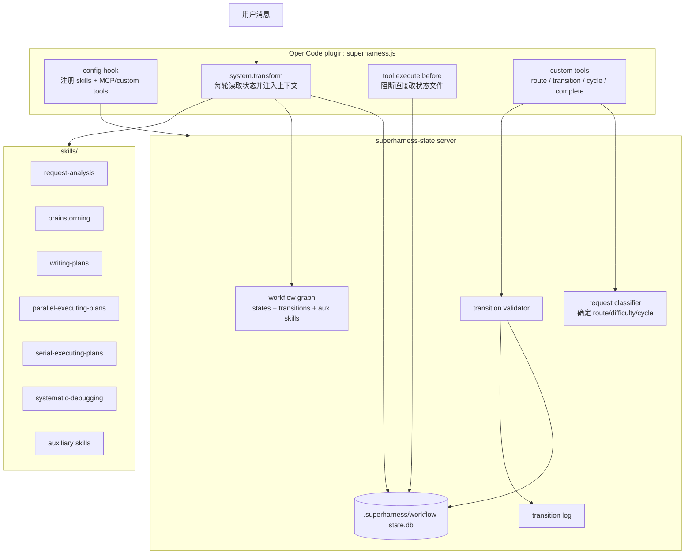
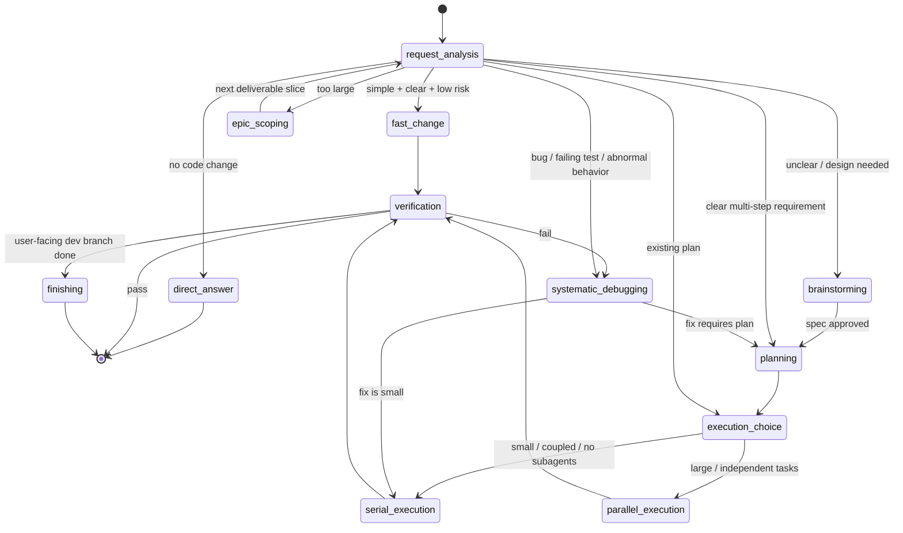

# 程序化状态机与 Hook 动态注入调研报告

## 结论

调研时，`superharness` 的多 skill 工作流主要靠 `using-superpowers/SKILL.md` 的文字规则和各 skill 的 description 触发，属于“prompt 纪律驱动”。该机制现已废弃并归档；它的问题不是缺少更多路由说明，而是状态事实、路由决策、合法跳转和上下文注入都没有由程序维护。

建议采用混合方案：

- 借鉴 `novel-workflow`：用 OpenCode plugin 的 `experimental.chat.system.transform` 在每轮模型调用前读取持久状态，并动态注入当前状态对应的 skill 上下文；用 MCP/自定义 tool 执行状态跳转；用 `tool.execute.before` 阻断 agent 直接改状态文件。
- 借鉴 `red-queen`：把状态图从 skill 文案中抽出来，放进可校验配置；每个状态声明 `skill`、`next`、`onFail`、`auxiliarySkills`、`maxIterations`、`gate` 等字段；状态变化写审计日志。
- 不建议照搬 `red-queen` 的完整外部 worker 编排器。`red-queen` 是“无人值守处理 issue/PR”的队列型系统；`superharness` 更适合做“当前会话内的轻量状态调度器”，否则会把简单问答和小改动再次拖进重型流水线。

## 调研对象

### novel-workflow

关键文件：

- `D:\WorkSpace\code\coding-agent-workspace\novel-workflow\docs\superpowers\specs\2026-05-12-opencode-state-machine-design.md`
- `D:\WorkSpace\code\coding-agent-workspace\novel-workflow\plugins\novel-workflow\.opencode\plugins\novel-workflow.js`
- `D:\WorkSpace\code\coding-agent-workspace\novel-workflow\plugins\novel-workflow\workflow-state-server\state.js`
- `D:\WorkSpace\code\coding-agent-workspace\novel-workflow\plugins\novel-workflow\workflow-state-server\server.js`
- `D:\WorkSpace\code\coding-agent-workspace\novel-workflow\plugins\novel-workflow\mcp-server\test\opencode-plugin-state.test.js`

核心机制：

1. `using-novel-workflow` 被废弃为运行时入口。状态机不再靠 agent 主动读取入口 skill，而由 plugin hook 注入。
2. OpenCode plugin 在 `config` hook 中注册 skill path 和 MCP server。
3. `experimental.chat.system.transform` 每轮调用前：
   - 打开 `.novel-workflow/workflow-state.db`
   - 初始化或恢复当前状态
   - 根据 `S1-S6 -> skillName` 映射读取对应 `SKILL.md`
   - 去掉 frontmatter
   - 把 `current_state / active_series_slug / chapter / allowed_transitions / hard guardrails` 与 skill 正文一起注入 system prompt
4. 状态跳转不允许直接写文件，必须调用 `novel-workflow-state_transition_workflow_state`。
5. `tool.execute.before` 拦截 `write/edit/apply_patch/bash` 对 `.novel-workflow/` 的写入。
6. `workflow-state-server/state.js` 是 hook 和 MCP server 的共享状态逻辑，避免 hook 与 tool 两套规则漂移。
7. 契约测试直接检查 plugin 源码是否包含关键 hook、状态映射、路径改写和阻断逻辑。

可直接复用的做法：

- “入口 skill 退场，状态 skill 由 hook 注入”
- “hook 只做轻量确定性工作，不让 LLM 在 hook 内决策”
- “MCP/custom tool 是唯一状态写入口”
- “状态 DB + transition log”
- “阻断直接修改状态目录”
- “把 `references/*.md` 在注入前改成绝对路径”
- “源码契约测试保证 hook 不被重构删掉”

主要局限：

- `novel-workflow` 是固定 6 状态线性业务流，状态空间简单。
- 它的初始化逻辑是业务定制的，不能直接套到通用开发任务。
- 它没有处理“一个大项目拆多个开发周期”的通用 cycle 模型。

### red-queen

关键文件：

- `references\red-queen\AGENTS.md`
- `references\red-queen\README.md`
- `references\red-queen\src\core\types.ts`
- `references\red-queen\src\core\config.ts`
- `references\red-queen\src\core\defaults.ts`
- `references\red-queen\src\core\orchestrator.ts`
- `references\red-queen\src\core\skill-context.ts`
- `references\red-queen\src\core\pipeline-state.ts`
- `references\red-queen\src\core\queue.ts`
- `references\red-queen\src\dashboard\api\workflow.ts`
- `references\red-queen\src\skills\README.md`

核心机制：

1. 状态图不是写死在 prompt 中，而是 `PhaseDefinition[]`：
   - `name`
   - `label`
   - `type: automated | human-gate`
   - `skill`
   - `next`
   - `onFail`
   - `rework`
   - `maxIterations`
   - `escalateTo`
   - `assignTo`
   - `requiresPr`
2. `validatePhaseGraph()` 校验：
   - 自动阶段必须有 skill
   - human gate 必须 assign 给 human
   - `next/onFail/rework/escalateTo` 必须引用存在的阶段或 `done`
   - 孤儿阶段、缺少 maxIterations 等给 warning
3. `PipelineStateStore` 持久化每个 issue 的当前 phase、分支、PR、迭代次数、上阶段 handoff。
4. `TaskQueue` 用 SQLite 管 ready/working/complete/failed 队列，并可 crash recovery。
5. `renderSkillPrompt()` 在每个 worker prompt 顶部注入稳定的 YAML context，再拼接 skill 正文。
6. worker 是隔离 Claude Code 子进程：`claude -p "Read and follow <tempPrompt> exactly" --no-session-persistence`。
7. `handleSuccess()` 默认按 `next` 推进；如果 agent 已经在外部 tracker 改了 phase，编排器尊重 agent 决策。
8. dashboard 支持在线编辑 workflow phases、保存配置、热 reload，并在队列为空时才允许保存。

可借鉴的做法：

- 状态图配置化，不让 skill 文档成为唯一真相源。
- 对状态图做结构校验和热 reload。
- 每个状态注入结构化 context，而不是只注入自然语言。
- transition 都进入审计日志。
- `human-gate` 是一等状态，而不是普通 skill 的一句说明。
- `maxIterations + escalateTo` 是解决无限返工循环的关键。
- skill override、disabled、搜索路径优先级值得借鉴。

不应直接照搬的部分：

- 外部 issue tracker / PR / worker queue 对 `superharness` 过重。
- 当前项目是通用 skill 插件，不应该强制所有用户用 Jira/GitHub issue 驱动。
- `red-queen` 的 phase 是“无人值守自动执行”；`superharness` 的多数工作仍然需要当前会话和用户互动。

## 当前 superharness 的落点

当前 OpenCode 插件入口：

- `plugins/superharness/.opencode/plugins/superharness.js`

调研时的历史能力（已废弃）：

- `config` hook 注册 `plugins/superharness/skills`
- `experimental.chat.messages.transform` 把 `using-superpowers` 注入第一条 user message

调研时的 Claude/Codex/Cursor hook（已废弃）：

- `plugins/superharness/hooks/session-start`
- `plugins/superharness/hooks/hooks-codex.json`

当前限制：

- 状态不持久化。
- 无状态跳转工具。
- 无合法跳转校验。
- 无任务难度分级。
- `using-superpowers` 的路由表无法避免 prompt 越写越重。
- OpenCode 使用 `messages.transform` 注入 user message，不如 `system.transform` 稳定。
- Claude/Codex 当前只有 SessionStart 注入，做不到 OpenCode 那种每轮动态 system 注入。

## 推荐目标架构



## 状态模型建议

不要把所有 active skill 都做成互相跳转的主状态。建议分三层：

### 1. 会话入口状态

| 状态 | 主 skill | 作用 |
|---|---|---|
| `request-analysis` | 新增 | 理解用户意图、判断是否需要改代码、判断任务难度、选择 route |
| `direct-answer` | 无需注入完整 skill | 只问答 / 解释 / 查代码，不进入开发周期 |
| `fast-change` | 可新增轻量 skill，或只注入 guard | 简单明确小改动，允许跳过 brainstorming/writing-plans |

### 2. 主开发周期状态

| 状态 | 主 skill | 作用 |
|---|---|---|
| `brainstorming` | `brainstorming` | 需求不清或需要设计确认 |
| `planning` | `writing-plans` | 规格转实现计划 |
| `parallel-execution` | `parallel-executing-plans` | 大计划并行 wave 执行 |
| `serial-execution` | `serial-executing-plans` | 小计划或强耦合计划串行执行 |
| `finishing` | `finishing-a-development-branch` | 收尾、PR、合并、清理 |

### 3. 侧路与横切状态

| 类型 | skill | 调度方式 |
|---|---|---|
| bug / 测试失败 | `systematic-debugging` | 可从任意状态抢占进入，完成后回原状态或进入 execution |
| 实现纪律 | `test-driven-development` | 作为 auxiliary 注入或在 execution guard 中强制 |
| 完成前验证 | `verification-before-completion` | 作为 finishing / execution 的完成闸门 |
| code review | `requesting-code-review` / `receiving-code-review` | execution/finishing 的可选 gate |
| 中文特色 | `chinese-*` | 根据中文用户、Git 平台、文档/commit/review 场景叠加 |
| MCP / skill 开发 | `mcp-builder` / `writing-skills` | 专项 route，必要时再进入 planning/execution |

## 状态图建议



## 配置格式建议

新增：

`plugins/superharness/workflow/superharness-workflow.yaml`

示例：

```yaml
states:
  - name: request-analysis
    label: 需求分析
    type: router
    skill: request-analysis
    routes:
      direct-answer: direct-answer
      fast-change: fast-change
      design-needed: brainstorming
      clear-multistep: planning
      existing-plan: execution-choice
      bug: systematic-debugging
      epic: epic-scoping

  - name: brainstorming
    label: 方案澄清
    type: interactive
    skill: brainstorming
    next: planning

  - name: planning
    label: 编写计划
    type: interactive
    skill: writing-plans
    next: execution-choice

  - name: serial-execution
    label: 串行执行
    type: execution
    skill: serial-executing-plans
    next: verification
    auxiliarySkills:
      - test-driven-development

  - name: parallel-execution
    label: 并行执行
    type: execution
    skill: parallel-executing-plans
    next: verification
    auxiliarySkills:
      - test-driven-development
      - requesting-code-review

  - name: verification
    label: 完成前验证
    type: gate
    skill: verification-before-completion
    next: finishing
    onFail: systematic-debugging

  - name: finishing
    label: 开发分支收尾
    type: gate
    skill: finishing-a-development-branch
    next: done
```

## 持久化模型建议

目录：

`.superharness/workflow-state.db`

表：

```sql
CREATE TABLE workflow_state (
  workspace_id TEXT PRIMARY KEY,
  session_id TEXT,
  cycle_id TEXT,
  state TEXT NOT NULL,
  route TEXT,
  difficulty TEXT,
  status TEXT NOT NULL DEFAULT 'active',
  task_summary TEXT,
  active_plan_path TEXT,
  previous_state TEXT,
  updated_at INTEGER NOT NULL
);

CREATE TABLE workflow_transition_log (
  id INTEGER PRIMARY KEY,
  workspace_id TEXT NOT NULL,
  cycle_id TEXT,
  from_state TEXT,
  to_state TEXT,
  route TEXT,
  difficulty TEXT,
  reason TEXT NOT NULL,
  source TEXT NOT NULL,
  created_at INTEGER NOT NULL
);

CREATE TABLE development_cycles (
  cycle_id TEXT PRIMARY KEY,
  workspace_id TEXT NOT NULL,
  parent_cycle_id TEXT,
  title TEXT NOT NULL,
  slice_summary TEXT,
  status TEXT NOT NULL DEFAULT 'active',
  created_at INTEGER NOT NULL,
  updated_at INTEGER NOT NULL
);
```

关键点：

- `cycle_id` 用来支持巨大项目拆多个开发周期。
- `request-analysis` 不应该永久强制进入完整主流程；它可以直接结束。
- `previous_state` 用于 `systematic-debugging` 这类抢占状态恢复上下文。
- 所有写操作必须有 `reason`。

## Tool 设计建议

可以先用 MCP server 实现，跨工具更稳；OpenCode 下再加 custom tools 做更好的命名和体验。

建议 MCP tools：

| tool | 作用 |
|---|---|
| `get_workflow_state` | 读取当前 workspace 状态 |
| `classify_request` | 写入本轮 route/difficulty/needs_code_change；可由 agent 在需求分析末尾调用 |
| `transition_workflow_state` | 校验并执行状态跳转 |
| `start_development_cycle` | 创建可交付切片 cycle |
| `complete_development_cycle` | 标记一个 cycle 完成 |
| `set_active_plan` | 绑定当前 plan 文件 |
| `list_workflow_history` | 查看审计日志 |
| `reset_workflow_state` | 需用户明确确认后重置 |

`classify_request` 不建议完全交给程序用关键词硬判。更稳的做法：

- hook 每轮注入 `request-analysis` 的短规则。
- agent 做语义判断后调用 `classify_request`。
- tool 只校验输出枚举、记录审计、返回下一状态。

这样可以兼顾“程序化状态管理”和“复杂意图由 LLM 理解”。

## Hook 注入策略

OpenCode MVP：

1. 将 `plugins/superharness/.opencode/plugins/superharness.js` 的 `messages.transform` 改为 `system.transform`。
2. 每轮读取 `workflow_state`。
3. 如果无状态，注入 `request-analysis`，不要注入完整主开发周期。
4. 如果已有状态，注入：
   - 当前状态 YAML context
   - 主 skill 正文
   - auxiliary skill 的短 guard 或完整正文
   - allowed transitions
   - 本轮结束前必须判断是否 transition
5. 如果状态 server 不可用，注入 stop-work 提示，不要让 agent 编造状态。
6. 用 `tool.execute.before` 阻断直接写 `.superharness/`。

注入模板：

```text
<SUPERPOWERS_WORKFLOW_STATE>
Runtime facts:
- current_state: planning
- route: clear-multistep
- difficulty: medium
- cycle_id: ...
- active_plan_path: docs/...
- allowed_transitions: ["serial-execution", "parallel-execution", "brainstorming"]
- auxiliary_skills: ["chinese-documentation"]

Rules:
- Follow the active skill below for this turn.
- If this turn satisfies the exit condition, call transition_workflow_state.
- Do not edit .superharness/ directly.
- If no code change is needed, answer directly and transition to done.

--- Active skill: writing-plans ---
...

--- Auxiliary skill guard: chinese-documentation ---
...
</SUPERPOWERS_WORKFLOW_STATE>
```

## 对现有 active skill 的处理建议

| skill | 调度方式 |
|---|---|
| `brainstorming` | 主状态 skill |
| `writing-plans` | 主状态 skill |
| `parallel-executing-plans` | 主状态 skill |
| `serial-executing-plans` | 主状态 skill |
| `finishing-a-development-branch` | 主状态 skill |
| `systematic-debugging` | 抢占/侧路状态 skill |
| `dispatching-parallel-agents` | 非 plan 并发侧路 |
| `workflow-runner` | YAML 工作流侧路 |
| `mcp-builder` | 专项 route，可叠加 planning/execution |
| `writing-skills` | 专项 route，可叠加 TDD |
| `test-driven-development` | execution/debug 的 auxiliary |
| `verification-before-completion` | verification gate |
| `requesting-code-review` | execution/finishing 可选 gate |
| `receiving-code-review` | review feedback 侧路 |
| `using-git-worktrees` | execution 前 auxiliary |
| `chinese-code-review` | review 场景 auxiliary |
| `chinese-git-workflow` | Git 平台辅助 |
| `chinese-commit-conventions` | commit/finishing 辅助 |
| `chinese-documentation` | 文档/规格/计划辅助 |

## 分阶段实施路线

### Phase 1：OpenCode MVP

目标：先证明动态注入和状态跳转可行。

改动：

- 新增 `plugins/superharness/workflow-state-server/`
- 新增 `plugins/superharness/workflow/superharness-workflow.yaml`
- 新增 `request-analysis` skill
- 修改 `plugins/superharness/.opencode/plugins/superharness.js`
  - 注册 MCP server
  - 注册 skill path
  - 改用 `experimental.chat.system.transform`
  - 注入当前状态 skill
  - 阻断 `.superharness/` 直接写入
- 加契约测试，参考 novel-workflow 的 `opencode-plugin-state.test.js`

验收：

- 简单问答只注入 request-analysis，不进入开发生命周期。
- 简单小改可进入 fast-change。
- 多步骤需求进入 planning。
- 状态跳转有审计日志。
- 直接改 `.superharness/workflow-state.db` 被阻断。

### Phase 2：状态图配置化

目标：引入 red-queen 式状态定义和校验。

改动：

- 实现 `validateWorkflowGraph()`
- 支持 `auxiliarySkills`
- 支持 `maxIterations / escalateTo`
- 支持 `cycle_id`
- 支持 `superharness workflow validate` 测试命令或 MCP read tool

验收：

- 配置引用不存在 skill 时失败。
- transition 到非法状态时失败。
- `systematic-debugging` 可从任意状态抢占，并能回到 previous_state。

### Phase 3：多开发周期

目标：支持大型项目拆可交付切片。

改动：

- `development_cycles` 表
- `epic-scoping` route
- `start_development_cycle` / `complete_development_cycle`
- `request-analysis` 能把超大请求拆成第一个 cycle，而不是强行进一个 plan。

验收：

- 一个 epic 下能存在多个 cycle。
- 每个 cycle 有独立状态、plan、验证和收尾记录。

### Phase 4：跨平台兼容

目标：OpenCode 是完整体验，Claude/Codex 做降级体验。

建议：

- OpenCode：完整 system.transform + custom tool/MCP。
- Claude/Codex：通过 `UserPromptSubmit` additionalContext 注入当前工作流状态上下文；如果平台没有每轮 system transform，则不称为 system prompt 注入。
- 不保留 `using-superpowers` 作为 fallback；该入口 skill 已归档禁用。

## 风险与约束

1. OpenCode hook 能力与 Claude/Codex hook 能力不对等，不能假设所有平台都能每轮动态注入。
2. 如果 `classify_request` 完全程序化关键词判断，会误判中文复杂需求；建议由 agent 语义判断，tool 负责校验和持久化。
3. 不要把 auxiliary skill 全文都无脑注入，否则上下文会膨胀；优先注入短 guard，必要时再让 agent 显式读取完整 skill。
4. 状态机不能替代用户确认。`brainstorming`、`writing-plans`、`finishing` 仍需保留人类 gate。
5. `.superharness/` 写入拦截要保守，但不能阻断普通读操作。
6. 状态 DB 损坏时必须 stop-work，不应自动覆盖。

## 推荐下一步

先做一个 OpenCode-only 的实验分支：

1. 新建 `request-analysis` skill。
2. 新建 `workflow-state-server`，只实现 5 个 tool：`get_workflow_state`、`classify_request`、`transition_workflow_state`、`list_workflow_history`、`reset_workflow_state`。
3. 修改 OpenCode plugin，从 `messages.transform` 迁移到 `system.transform`。
4. 只支持 6 个核心状态：`request-analysis`、`fast-change`、`brainstorming`、`planning`、`execution`、`verification`。
5. 跑通后再把 `parallel/serial/finishing/debug/auxiliary/chinese-*` 展开。

这个路径的关键是先把“状态事实由代码维护，skill 上下文由 hook 注入”跑通，而不是一开始就把所有 active skill 编进一张巨大状态图。


