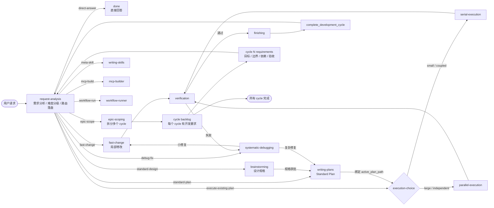

# 主开发周期分流设计（二期）

## 背景

当前 `superharness` 的主开发生命周期默认倾向于完整链路：

`brainstorming -> writing-plans -> executing-plans -> finishing`

这套流程适合中大型功能开发，但对简单问答、小改动和已有计划执行过重；对超大项目又不够，因为它缺少多开发周期拆分和可交付切片管理。前序调研和一期实现已经确认：`using-superpowers` 作为状态机入口的方案已废弃；状态事实、路由决策、合法跳转和上下文注入应由 hook + MCP 状态工具程序化管理。

一期开发任务聚焦：

- 程序化状态机管理
- Hook 动态注入当前状态 skill 上下文
- 状态持久化、跳转校验和审计日志
- 阻断 agent 直接修改状态文件

本规格是二期开发任务，只设计“主开发周期分流”业务层。它默认一期已经提供可用的状态读取、状态跳转、hook 注入和 workflow 配置校验能力。

## 目标

1. 引入统一的 `request-analysis` 入口阶段，负责需求分析、任务难度分级和路由决策。
2. 区分无需改动、简单小改、标准开发周期、已有计划执行、调试修复、超大项目拆分等路径。
3. 避免简单任务被强制拉进完整 `brainstorming -> writing-plans` 流程。
4. 支持超大需求拆成多个可交付切片，每个切片独立进入开发周期。
5. 让主开发周期的路由结果可审计、可恢复、可验证，而不是只存在于模型上下文中。
6. 保持 20 个现有 skill 的职责边界，不把所有 skill 都升级为主状态。

## 非目标

- 不实现一期的状态机基础设施、MCP server、SQLite schema 或 hook 注入机制。
- 不重写 `parallel-executing-plans` 的内部 wave 执行协议。
- 不引入 Red Queen 式外部 issue 队列或无人值守 worker 编排。
- 不要求 Claude/Codex 平台达到 OpenCode 的每轮动态 system 注入能力。
- 不把 `chinese-*`、`test-driven-development`、`verification-before-completion` 等横切 skill 改造成主生命周期状态。
- 不恢复或强化 `using-superpowers` 入口路由；二期只在程序化状态机之上新增业务分流。

## 设计原则

- **先分流，再加重。** 只有确认需要设计、计划或多步执行时，才进入完整开发周期。
- **路由结果要落盘。** `route`、`difficulty`、`needs_code_change`、`cycle_id` 等结果必须写入状态机审计日志。
- **简单任务有快速路径。** 小范围、低风险、用户意图明确的修改可以跳过 `brainstorming` 和 `writing-plans`。
- **大任务按可交付切片拆。** 超大需求不能塞进一个 plan；先拆成多个 cycle，再逐个推进。
- **横切 skill 按场景叠加。** TDD、验证、代码审查、中文文档、中文 commit 等作为辅助约束注入，不作为默认 next state。
- **用户 gate 保留。** `brainstorming`、计划批准、收尾策略仍需用户确认；程序化路由不能替代用户决策。

## 方案选择

### 方案 A：恢复 `using-superpowers` 入口路由（已废弃）

把任务难度分级、快速路径、超大项目拆分全部写进 `using-superpowers/SKILL.md`，让它继续承担入口路由。

优点：

- 改动最小。
- 跨平台最容易保持一致。

缺点：

- 与一期“hook 注入 + MCP 管理状态机”的方向冲突。
- 规则越来越重，和当前问题同源。
- 路由结果不可恢复、不可审计。
- 模型可能忽略或误读长篇入口规则。

### 方案 B：一期状态机 + 二期路由配置（推荐）

一期提供程序化状态机和 hook 注入；二期新增 `request-analysis`、路由枚举、任务难度分级、可交付切片和 route-specific 注入策略。

优点：

- 路由规则从 skill 文案中抽离，便于测试和演进。
- 简单任务不会默认进入完整开发周期。
- 大项目可以用 cycle 管理多个开发周期。
- 仍保留 agent 对复杂中文意图的语义判断能力。

缺点：

- 依赖一期基础设施。
- OpenCode 体验会领先于 Claude/Codex。

### 方案 C：照搬 Red Queen 队列式编排

把每个开发任务变成外部队列 task，每个 phase 派独立 worker。

优点：

- 自动化程度高。
- 强审计、强恢复。

缺点：

- 对通用 skill 插件过重。
- 会牺牲当前会话内协作体验。
- 简单问答和小改动仍然被工具链复杂度拖累。

采用方案 B。

## 核心概念

### Route

`route` 是对用户请求的处理路径分类。

| route | 含义 | 默认下一状态 |
|---|---|---|
| `direct-answer` | 只问答、解释、查代码、总结，不需要修改文件 | `done` |
| `fast-change` | 简单明确的小改动，局部修改即可完成 | `fast-change` |
| `standard-design` | 需求需要澄清、设计权衡或用户确认 | `brainstorming` |
| `standard-plan` | 需求清晰但多步骤，需要写计划 | `planning` |
| `execute-existing-plan` | 用户提供或仓库已有可执行 plan | `execution-choice` |
| `debug-fix` | bug、测试失败、异常行为 | `systematic-debugging` |
| `epic-scope` | 目标过大，需要拆多个开发周期 | `epic-scoping` |
| `meta-skill` | 创建或修改 skill | `writing-skills` |
| `mcp-build` | 构建 MCP server/tool | `mcp-builder` |
| `workflow-run` | 运行 YAML 多角色工作流 | `workflow-runner` |

### Difficulty

`difficulty` 是执行复杂度分级，不等于工作量估算。

| difficulty | 判断标准 | 默认处理 |
|---|---|---|
| `answer-only` | 不需要写文件、不需要运行验证 | 直接回答 |
| `trivial` | 单文件或极少量改动，行为明确，失败风险低 | fast path |
| `small` | 少量文件，可能需要测试，但不需要正式 plan | fast path + verification |
| `medium` | 多文件或多步骤，需要明确任务拆分 | planning + serial execution |
| `large` | 可拆并行任务，存在集成风险 | planning + parallel execution |
| `epic` | 一个开发周期无法完成，需要多个可交付切片 | epic scoping |

### Development Cycle

`development_cycle` 是一个可交付切片，不是一次对话。一个 epic 可以包含多个 cycle。

字段建议：

- `cycle_id`
- `parent_cycle_id`
- `title`
- `slice_summary`
- `acceptance_criteria`
- `status: active | blocked | completed | abandoned`
- `active_plan_path`

### Standard Plan 与 Development Cycle

`Standard Plan` 是二期里最小的标准开发周期执行单元。每一个 `development_cycle` 必须至多绑定一个当前活跃的 Standard Plan；一个 epic 不是一个超大 plan，而是一组按依赖排序的 Standard Plan 周期。

Standard Plan 的生命周期固定为：

1. `request-analysis` 接收当前 cycle 的开发要求。
2. 需求仍需设计时进入 `brainstorming`，输出或更新 cycle 级规格。
3. 需求已经清晰时进入 `writing-plans`，生成当前 cycle 的 plan。
4. `execution-choice` 根据 plan metadata 选择 `serial-execution` 或 `parallel-execution`。
5. 执行完成后进入 `verification` 和 `finishing`。
6. `complete_development_cycle` 关闭当前 cycle，再由 `request-analysis` 决定是否启动下一个 cycle。

每个 Standard Plan 必须只覆盖一个可交付切片，禁止把多个 cycle 的详细实现步骤塞进同一个 plan。跨 cycle 的内容只能写成依赖、接口契约或后续 cycle 输入，不应在当前 plan 中展开执行步骤。

## 状态图



## `request-analysis` Skill 设计

新增 skill：

`plugins/superharness/skills/request-analysis/SKILL.md`

职责：

1. 理解用户请求，不执行业务修改。
2. 判断是否需要文件改动。
3. 判断 `route` 和 `difficulty`。
4. 判断是否需要创建或切换 `development_cycle`。
5. 调用状态 tool 写入分类结果。
6. 若为 `direct-answer`，允许直接回答并结束。
7. 若需要进入后续状态，调用 `transition_workflow_state`。

禁止：

- 不直接 Edit/Write 业务文件。
- 不创建 plan。
- 不启动子代理。
- 不把不明确的大需求强行标成 `medium`。

输出 discipline：

```text
在本轮结束前必须完成：
- route
- difficulty
- needs_code_change
- next_state
- reason
```

## 分流规则

### Direct Answer

进入条件：

- 用户只问概念、解释、对比、代码位置、现有行为。
- 不需要文件修改。
- 不需要运行验证命令才能给出结论。

行为：

- 不进入开发周期。
- 可读文件、搜索代码、回答。
- 状态记录为 `done` 或保持 `request-analysis` idle。

示例：

- “这个 skill 是怎么调用的？”
- “有没有 skill 显式进入 systematic-debugging？”
- “解释一下当前状态图。”

### Fast Change

进入条件：

- 用户要求修改文件。
- 需求明确。
- 改动局部、低风险。
- 不需要方案权衡。
- 不需要正式实现计划。

行为：

- 注入 fast-change guard。
- 可叠加 `test-driven-development` 的轻量版要求：风险足够低时允许先改后验证，但必须说明验证方式。
- 完成后进入 `verification`。

示例：

- “把这个文案改一下。”
- “补一个 README 链接。”
- “修一个明显 typo。”

### Standard Design

进入条件：

- 需求有多个设计选择。
- 用户意图、约束或验收标准不清。
- 改动会影响行为、架构或长期维护。

行为：

- 进入 `brainstorming`。
- 获得用户批准后进入 `planning`。

示例：

- “优化主开发周期状态。”
- “设计程序化状态机和 hook 注入方案。”

### Standard Plan

进入条件：

- 用户目标清晰。
- 已有规格或需求足够明确。
- 实现涉及多个步骤或多个文件。

行为：

- 进入 `writing-plans`。
- 输出 plan 后进入 `execution-choice`。

示例：

- “按这个 spec 写实现计划。”
- “给这个设计落一个开发计划。”

### Existing Plan

进入条件：

- 用户提供了 plan。
- 仓库已有明确 plan 文件。
- 用户要求按 plan 执行。

行为：

- 跳过 `brainstorming` 和 `writing-plans`。
- 进入 `execution-choice`。
- 根据任务独立性选择 serial 或 parallel。

### Debug Fix

进入条件：

- 用户报告 bug、测试失败、异常行为。
- 验证命令失败。
- 实现过程中发现行为与预期不一致。

行为：

- 进入 `systematic-debugging`。
- 修复很小时可回 `fast-change`。
- 修复复杂时进入 `planning`。

### Epic Scope

进入条件：

- 请求跨多个独立模块、多个功能面或多个发布目标。
- 单个 plan 无法合理覆盖。
- 验收标准无法一次性验证。

行为：

- 进入 `epic-scoping`。
- 输出可交付切片列表，且每个切片必须具备独立开发要求。
- 为每个切片创建或登记 `development_cycle` 草案。
- 只激活第一个可执行 `development_cycle`。
- 将当前激活切片重新送回 `request-analysis`，由它路由到 `standard-design`、`standard-plan` 或 `execute-existing-plan`。
- 当前 cycle 完成后由 `complete_development_cycle` 标记关闭，再启动下一个未完成 cycle。

每个 cycle 的开发要求必须包含：

- `title`：一句话说明本周期交付什么。
- `goal`：用户可感知或工程上可验证的目标。
- `scope`：本周期明确包含和明确不包含的内容。
- `dependencies`：依赖的前序 cycle、外部约束或接口契约。
- `acceptance_criteria`：可执行的验收条件。
- `recommended_route`：建议进入 `standard-design`、`standard-plan` 或 `execute-existing-plan`。
- `risk_level`：`low | medium | high`，用于决定是否必须进入设计和审查 gate。

约束：

- `epic-scoping` 只拆 cycle，不写任何 cycle 的完整实现 plan。
- 一个 Standard Plan 只服务一个 cycle。
- 后续 cycle 不允许提前进入实现；只能保留目标、边界、依赖和验收标准。
- 如果当前 cycle 的输出会改变后续 cycle 的边界，必须回到 `epic-scoping` 更新 backlog，而不是直接修改后续 plan。

## `epic-scoping` 设计

可以新增轻量 skill：

`plugins/superharness/skills/epic-scoping/SKILL.md`

职责：

- 把超大目标拆成多个可独立交付、可验证、可回滚的 cycle。
- 为每个 cycle 写清开发要求：目标、边界、依赖、验收标准、推荐 route、风险等级和执行顺序。
- 维护 cycle backlog，确保同一时间只有一个 active cycle 进入 Standard Plan。
- 在当前 cycle 完成后选择下一个未完成 cycle，并把它交回 `request-analysis` 重新分流。
- 只启动第一个 cycle，不展开所有 cycle 的详细 plan。

退出条件：

- 用户批准切片列表。
- 调用 `start_development_cycle` 创建第一个 active cycle。
- 跳回 `request-analysis` 处理第一个 cycle 的开发要求。

重新进入条件：

- 当前 cycle 完成，需要启动下一个 cycle。
- 当前 cycle 执行结果改变后续 cycle 依赖或边界。
- 用户调整 epic 范围、优先级或验收顺序。

## Execution Choice

`execution-choice` 可以不是独立 skill，而是状态机 guard。

选择 `serial-execution`：

- 任务之间强耦合。
- 文件写集合重叠。
- 子代理不可用。
- 总任务数少。

选择 `parallel-execution`：

- 任务可拆成互不覆盖的文件或模块。
- 有明确 plan。
- 可以定义 wave 和 claimed files。
- 有足够验证手段合并结果。

如果判断不确定，默认 `serial-execution`。

## 辅助 Skill 注入策略

二期不把辅助 skill 全文全部注入。默认注入短 guard，需要时让 agent 显式读取完整 skill。

| 场景 | 辅助 skill | 注入方式 |
|---|---|---|
| 实现或修复 | `test-driven-development` | fast-change 注入短 guard；standard execution 可注入完整规则 |
| 完成前声明 | `verification-before-completion` | verification 状态注入完整规则 |
| 重要功能或合并前 | `requesting-code-review` | execution/finishing 可选 gate |
| 收到审查反馈 | `receiving-code-review` | 抢占式侧路 |
| 隔离开发 | `using-git-worktrees` | planning/execution 前按需注入 |
| 中文审查 | `chinese-code-review` | review 场景 guard |
| 国内 Git 平台 | `chinese-git-workflow` | finishing 场景 guard |
| 中文 commit | `chinese-commit-conventions` | commit 场景 guard |
| 中文文档 | `chinese-documentation` | docs/spec/README 场景 guard |

## 状态持久化字段

二期依赖一期的 `workflow_state`，需要扩展或使用以下字段：

```sql
route TEXT,
difficulty TEXT,
needs_code_change INTEGER,
cycle_id TEXT,
active_plan_path TEXT,
previous_state TEXT,
task_summary TEXT
```

新增 `development_cycles`：

```sql
CREATE TABLE development_cycles (
  cycle_id TEXT PRIMARY KEY,
  workspace_id TEXT NOT NULL,
  parent_cycle_id TEXT,
  title TEXT NOT NULL,
  slice_summary TEXT NOT NULL,
  acceptance_criteria TEXT NOT NULL,
  status TEXT NOT NULL DEFAULT 'active',
  active_plan_path TEXT,
  created_at INTEGER NOT NULL,
  updated_at INTEGER NOT NULL
);
```

## Tool 需求

二期需要一期提供或扩展以下 tool：

| tool | 二期用途 |
|---|---|
| `classify_request` | 写入 `route`、`difficulty`、`needs_code_change`、`reason` |
| `transition_workflow_state` | 根据 route 进入下一状态 |
| `start_development_cycle` | 为 epic 的第一个或后续切片创建 cycle |
| `complete_development_cycle` | 标记当前切片完成 |
| `list_development_cycles` | 展示 epic backlog、当前 active cycle 和后续 cycle 状态 |
| `update_development_cycle` | 当前 cycle 输出改变后续边界时更新 cycle 开发要求 |
| `set_active_plan` | 绑定 plan 文件，供 execution-choice 使用 |
| `get_workflow_state` | hook 注入时读取当前 route/cycle/plan |
| `list_workflow_history` | 调试和审计 |

## Hook 注入要求

一期 hook 在二期需要支持 route-aware 注入：

1. 无状态或状态为 `request-analysis`：只注入 `request-analysis`，不要注入完整主生命周期。
2. `direct-answer`：不注入开发 skill，只保留轻量 guard。
3. `fast-change`：注入 fast-change guard、允许局部修改、要求验证。
4. `brainstorming` / `planning` / `execution`：注入对应主 skill。
5. `verification`：注入 `verification-before-completion`。
6. `systematic-debugging`：抢占注入调试 skill，并保留 `previous_state`。
7. `epic-scoping`：注入 epic 拆分规则，不允许直接写完整实现 plan。

## 配置示例

```yaml
routes:
  direct-answer:
    next: done
    inject: minimal
  fast-change:
    next: fast-change
    auxiliarySkills:
      - verification-before-completion
  standard-design:
    next: brainstorming
  standard-plan:
    next: planning
  execute-existing-plan:
    next: execution-choice
  debug-fix:
    next: systematic-debugging
  epic-scope:
    next: epic-scoping
    createsCycleBacklog: true

difficultyPolicy:
  answer-only:
    maxState: direct-answer
  trivial:
    defaultRoute: fast-change
  small:
    defaultRoute: fast-change
  medium:
    defaultRoute: standard-plan
  large:
    defaultRoute: standard-plan
    preferParallel: true
  epic:
    defaultRoute: epic-scope

cyclePolicy:
  oneActiveCycleOnly: true
  standardPlanPerCycle: true
  requireCycleRequirements:
    - title
    - goal
    - scope
    - dependencies
    - acceptance_criteria
    - recommended_route
    - risk_level
```

## 测试计划

### 单元测试

- `classify_request` 接受合法 route/difficulty。
- 非法 route 被拒绝。
- route 与 next state 映射正确。
- `epic` 难度必须进入 `epic-scoping`。
- `direct-answer` 不允许设置 `needs_code_change=true`。
- `fast-change` 不允许绑定大型 plan。
- 同一 workspace 同一时间最多只能有一个 active `development_cycle`。
- `set_active_plan` 只能绑定到 active cycle。
- `complete_development_cycle` 后，状态必须回到 `request-analysis` 或 `epic-scoping` 选择下一个 cycle。

### Hook 契约测试

- `request-analysis` 状态只注入 `request-analysis`。
- `direct-answer` 不注入 `brainstorming`、`writing-plans`、`parallel-executing-plans`。
- `fast-change` 注入快速修改 guard。
- `verification` 注入 `verification-before-completion`。
- `systematic-debugging` 注入 `previous_state`。

### Skill 合约测试

- `request-analysis/SKILL.md` 包含 route/difficulty 枚举。
- `request-analysis/SKILL.md` 禁止直接修改业务文件。
- `epic-scoping/SKILL.md` 要求输出可交付切片和验收标准。
- `epic-scoping/SKILL.md` 禁止为所有 cycle 展开完整实现 plan。
- `writing-plans/SKILL.md` 或二期注入 guard 必须声明一个 Standard Plan 只覆盖一个 active cycle。
- 所有新增 route 都能在 workflow 配置中找到 next state。

### 手工场景

| 输入 | 期望 |
|---|---|
| “解释一下这个 skill 怎么调用” | `direct-answer`，不进入开发周期 |
| “把 README 里这个链接改一下” | `fast-change -> verification` |
| “设计一个程序化状态机方案” | `standard-design -> brainstorming` |
| “按这个 spec 写实现计划” | `standard-plan -> planning` |
| “执行 docs/superharness/plans/xxx.md” | `execute-existing-plan -> execution-choice` |
| “测试失败了，帮我修” | `debug-fix -> systematic-debugging` |
| “重构整个插件并支持所有平台” | `epic-scope -> epic-scoping` |

## 文件清单

二期预计新增：

- `plugins/superharness/skills/request-analysis/SKILL.md`
- `plugins/superharness/skills/epic-scoping/SKILL.md`
- `plugins/superharness/workflow/routes.yaml`
- `plugins/superharness/workflow/difficulty-policy.yaml`
- `tests/workflow-routing.test.*`
- `tests/workflow-cycles.test.*`
- `tests/opencode-hook-routing-contract.test.*`
- `docs/multi-skill-workflow-state-machine.drawio`
- `docs/superharness/specs/2026-05-15-main-development-cycle-routing-design.md`

二期预计修改：

- `plugins/superharness/.opencode/plugins/superharness.js`
- `plugins/superharness/README.md`
- `README.md`

说明：`superharness.js` 的改动只使用一期暴露的状态机接口，不在二期重新实现状态机。

## 验收标准

- 简单问答不会触发完整开发生命周期。
- 简单小改不会强制进入 `brainstorming` 或 `writing-plans`。
- 中大型开发任务仍能进入标准生命周期。
- 已有 plan 可以直接进入执行选择。
- bug 和测试失败能抢占进入 `systematic-debugging`。
- epic 任务能拆成多个 `development_cycle`。
- Epic Scope 中每个 cycle 都有独立开发要求，且每个 cycle 可以复用 Standard Plan 生命周期。
- 一个 Standard Plan 不会跨多个 `development_cycle`。
- 每次 route 和 transition 都有审计记录。
- 所有新增 route、difficulty、state 都有测试覆盖。

## 自检

- 本规格没有把一期状态机基础设施重复列为二期实现内容。
- 本规格把 “需求分析 / 分流” 和 “主开发生命周期执行” 分开描述。
- 本规格没有要求所有 active skill 成为主状态。
- 本规格保留了简单任务快速路径和大任务多周期拆分。
- 本规格明确了 Epic Scope 的 cycle backlog 与 Standard Plan 的一对一关系。
- 本规格的新增文件清单与当前仓库结构兼容。


