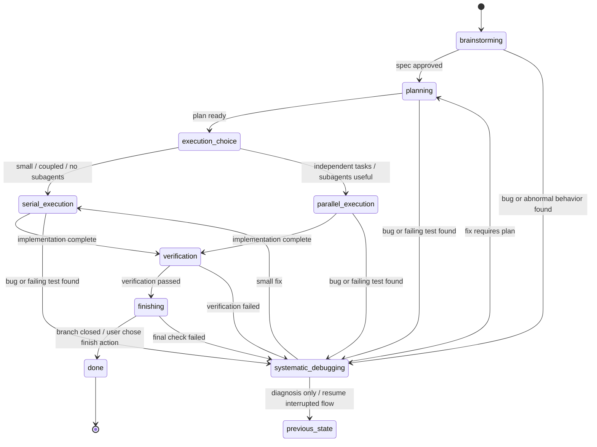

# 程序化状态机与 Hook 动态注入设计（一期）

## 背景

一期设计启动时，`superharness` 的多 skill 工作流主要依赖 `using-superpowers` 和各个 `SKILL.md` 的文字规则。该旧入口机制现已废弃并归档；它能表达流程纪律，但不能把“当前处于哪个阶段”“允许跳到哪里”“本轮应该注入哪个 skill”“为什么发生跳转”变成可校验、可审计、可恢复的事实。

一期目标是把现有主开发生命周期从 prompt 纪律升级为程序维护的状态机，并通过三端 hook 动态注入当前状态对应的 skill 上下文。

本设计基于两个参考项目的取舍：

- 参考 `novel-workflow`：每轮 hook 读取持久状态，渲染当前状态上下文，阻止 agent 直接修改状态目录。
- 参考 `red-queen`：状态图配置化、启动时严格校验、transition 写审计日志。
- 不照搬 `red-queen` 的外部 issue 队列、worker 编排、dashboard 和无人值守执行模型。

## 官方能力边界

三端不能被描述为同一种“system prompt 注入”。

| 平台 | 一期使用方式 | 官方能力边界 |
|---|---|---|
| OpenCode | plugin 每轮动态注入；优先使用 `experimental.chat.system.transform` | OpenCode 插件官方支持 custom tools 和 `tool.execute.before`；system transform 属于实验接口，需要契约测试兜底 |
| Claude Code | `UserPromptSubmit` hook 输出 `additionalContext` | 官方文档说明 `additionalContext` 会被包装成 system reminder 插入上下文，不是可任意改写 system prompt 的 API |
| Codex | `UserPromptSubmit` hook 输出 `additionalContext` | 官方文档说明 `additionalContext` 会作为 extra developer context 加入上下文，不是 system prompt 注入 |

因此，一期追求的是三端“语义同等”：

- 读取同一个 `.superharness/` 状态事实源。
- 使用同一份状态图配置和校验逻辑。
- 注入同一份渲染后的 workflow context。
- 暴露同一组状态工具。
- 对非法跳转和直接写状态目录执行同一类保护。

不承诺三端注入到模型上下文中的 role 完全一致。

## 目标

1. 用程序化状态机管理现有主开发生命周期 skill 的状态跳转。
2. 每轮根据当前状态动态注入“状态摘要 + 当前主 skill”。
3. 支持 Claude Code、Codex、OpenCode 三端语义同等。
4. 状态事实源落在项目内 `.superharness/`。
5. 状态图采用内部配置文件驱动，并严格校验。
6. 状态写入只能通过 MCP/custom tool，直接写 `.superharness/` 应被 hook 尽力阻止。
7. 所有 transition 写审计日志，并要求非空 `reason`。

## 非目标

- 不新增 skill。
- 不修改现有 `SKILL.md`。
- 不实现 `request-analysis`、`answer-only`、`fast-change`、难度分级或主开发周期分流。
- 不支持用户正式自定义状态图。
- 不支持多 development cycle。
- 不引入 red-queen 式外部 worker queue。
- 不做 dashboard。
- 不要求 Claude/Codex 达到 OpenCode 的 system transform 注入层级。

二期分流设计放在 `docs/superharness/specs/2026-05-15-main-development-cycle-routing-design.md`，不进入一期范围。

## 设计决策

### 三端同等体验

采用“语义同等”，不是“底层 API 同等”。

OpenCode 可以把 workflow context 放入 system transform；Claude Code 使用 system reminder；Codex 使用 developer context。三者注入内容由同一个 renderer 生成，避免文案和状态纪律分叉。

### 状态目录

状态事实源目录为：

```text
.superharness/
```

建议结构：

```text
.superharness/
  workflow.yaml
  workflow-state.db
  workflow-transition.log
```

`workflow.yaml` 是一期内部运行配置，不作为正式用户自定义能力发布。插件可以从内置默认配置初始化该文件，或在文件缺失时直接使用内置默认配置。人工修改该文件不作为一期承诺能力；如果内容不合法，运行时严格失败并注入 stop-work 提示。

### 配置开放程度

一期实现必须配置化，但不产品化自定义配置。

含义：

- 内部状态图由配置描述。
- 每个状态绑定已安装 skill 名。
- 状态图、skill 引用和 transition 边在启动或每轮注入前校验。
- 不写用户教程鼓励自定义状态图。
- 不支持任意文件路径作为 skill 来源。

## 状态图

一期只覆盖现有主开发生命周期 skill。



### 状态与 Skill 映射

| 状态 | 主 skill | 类型 |
|---|---|---|
| `brainstorming` | `brainstorming` | interactive |
| `planning` | `writing-plans` | interactive |
| `execution_choice` | 无独立 skill，状态机 guard | router |
| `serial_execution` | `serial-executing-plans` | execution |
| `parallel_execution` | `parallel-executing-plans` | execution |
| `verification` | `verification-before-completion` | gate |
| `finishing` | `finishing-a-development-branch` | gate |
| `systematic_debugging` | `systematic-debugging` | preemptive |
| `done` | 无 | terminal |

`execution_choice` 不注入独立 skill。renderer 注入短 guard：如果任务之间强耦合或子代理不可用，进入 `serial_execution`；如果计划包含独立任务、写集可拆分且平台支持子代理，进入 `parallel_execution`。

### 抢占状态

`systematic_debugging` 是抢占状态，可以从任意非终态进入。

进入时必须记录：

- `previous_state`
- `failure_summary`
- `reason`

退出策略：

- 如果只是诊断并需要恢复原流程，允许回 `previous_state`。
- 如果已经定位到小修复，进入 `serial_execution`。
- 如果修复需要设计或计划，进入 `planning`。

## Workflow 配置

默认配置示例：

```yaml
version: 1
entryState: brainstorming
terminalStates:
  - done

states:
  brainstorming:
    type: interactive
    skill: brainstorming
    next:
      - planning
      - systematic_debugging

  planning:
    type: interactive
    skill: writing-plans
    next:
      - execution_choice
      - systematic_debugging

  execution_choice:
    type: router
    next:
      - serial_execution
      - parallel_execution
      - systematic_debugging

  serial_execution:
    type: execution
    skill: serial-executing-plans
    next:
      - verification
      - systematic_debugging

  parallel_execution:
    type: execution
    skill: parallel-executing-plans
    next:
      - verification
      - systematic_debugging

  verification:
    type: gate
    skill: verification-before-completion
    next:
      - finishing
      - systematic_debugging

  finishing:
    type: gate
    skill: finishing-a-development-branch
    next:
      - done
      - systematic_debugging

  systematic_debugging:
    type: preemptive
    skill: systematic-debugging
    next:
      - previous_state
      - serial_execution
      - planning

  done:
    type: terminal
```

### 配置校验

严格失败条件：

- `entryState` 不存在。
- 状态名重复。
- `next` 引用不存在状态，且不是特殊目标 `previous_state`。
- 非 terminal 状态没有任何出口。
- 有主 skill 的状态引用了不存在的已安装 skill。
- execution/gate/interactive/preemptive 状态缺少主 skill。
- terminal 状态仍声明主 skill。
- `systematic_debugging` 缺少 `previous_state` 退出策略。

失败时 hook 注入 stop-work context，要求 agent 报告配置错误，不继续业务工作，不编造状态。

## 状态持久化

一期可以使用 SQLite，也可以使用现有项目偏好的轻量持久化实现；外部行为必须一致。

建议表：

```sql
CREATE TABLE workflow_state (
  workspace_id TEXT PRIMARY KEY,
  state TEXT NOT NULL,
  status TEXT NOT NULL DEFAULT 'active',
  previous_state TEXT,
  active_skill TEXT,
  task_summary TEXT,
  failure_summary TEXT,
  updated_at INTEGER NOT NULL
);

CREATE TABLE workflow_transition_log (
  id INTEGER PRIMARY KEY,
  workspace_id TEXT NOT NULL,
  from_state TEXT,
  to_state TEXT NOT NULL,
  previous_state TEXT,
  reason TEXT NOT NULL,
  source TEXT NOT NULL,
  created_at INTEGER NOT NULL
);
```

`source` 取值：

- `hook`
- `agent-tool`
- `user-reset`

无状态时初始化为 `brainstorming`。

## 工具设计

一期提供 5 个工具。OpenCode 可以注册 custom tools；三端都应通过 MCP 暴露同一组能力。

| 工具 | 作用 |
|---|---|
| `get_state` | 读取当前 workspace 的 workflow 状态、合法出口、当前主 skill |
| `classify_request` | 一期只记录任务摘要、建议执行分支或抢占原因；不实现二期路由和难度分级 |
| `transition_state` | 校验并执行状态跳转，写审计日志 |
| `list_history` | 查看 transition 审计日志 |
| `reset_state` | 明确重置当前 workspace 状态，source 为 `user-reset` |

### `transition_state`

必填字段：

```json
{
  "from_state": "planning",
  "to_state": "execution_choice",
  "reason": "Plan was approved by the user"
}
```

规则：

- `reason` 必须非空。
- `from_state` 必须等于存储中的当前状态。
- `to_state` 必须在当前状态的合法出口中。
- 跳入 `systematic_debugging` 时必须写 `previous_state`。
- `previous_state` 只允许在当前状态为 `systematic_debugging` 时作为目标使用。

## Hook 注入设计

### 注入内容

每轮注入由 renderer 生成：

```text
<SUPERHARNESS_WORKFLOW_STATE>
Runtime facts:
- current_state: planning
- previous_state: null
- active_skill: writing-plans
- allowed_transitions: ["execution_choice", "systematic_debugging"]
- state_directory: .superharness/

Rules:
- Follow the active skill below for this turn.
- If the state exit condition is met, call transition_state with a non-empty reason.
- Do not edit .superharness/ directly.
- If workflow config or state cannot be loaded, stop business work and report the error.

--- Active skill: writing-plans ---
...
</SUPERHARNESS_WORKFLOW_STATE>
```

`execution_choice` 没有主 skill，注入短 guard：

```text
Current state is execution_choice.
Choose exactly one next state:
- serial_execution when tasks are coupled, write sets overlap, or subagents are unavailable.
- parallel_execution when the approved plan has independent tasks and disjoint write scopes.
Call transition_state with the chosen next state and reason before implementation work.
```

### OpenCode

OpenCode adapter 负责：

- 注册 skills path。
- 注册 MCP server。
- 每轮调用共享库读取状态、校验配置、渲染 workflow context。
- 优先通过 `experimental.chat.system.transform` 注入。
- 通过 `tool.execute.before` 阻止直接写 `.superharness/`。
- 如果状态库不可用，注入 stop-work context。

### Claude Code

Claude adapter 负责：

- 在 `UserPromptSubmit` hook 中调用同一个 renderer。
- 通过 `hookSpecificOutput.additionalContext` 返回 context。
- 在 `PreToolUse` 中尽力阻止直接写 `.superharness/`。
- 使用 Claude Code 官方的 system reminder 注入语义，不称为 system prompt 注入。

### Codex

Codex adapter 负责：

- 在 `UserPromptSubmit` hook 中调用同一个 renderer。
- 通过 `hookSpecificOutput.additionalContext` 返回 context。
- 在 `PreToolUse` 中尽力阻止直接写 `.superharness/`。
- 使用 Codex 官方的 developer context 注入语义，不称为 system prompt 注入。

## 状态目录保护

禁止 agent 直接写：

- `.superharness/workflow-state.db`
- `.superharness/workflow-transition.log`
- `.superharness/workflow.yaml`
- `.superharness/` 下其他运行时状态文件

允许读 `.superharness/`，用于诊断和向用户解释当前状态。

阻断范围：

- OpenCode：`write`、`edit`、`apply_patch`、`bash` 中触及 `.superharness/` 的写操作。
- Claude/Codex：`PreToolUse` 覆盖平台暴露的写文件、patch 和 shell 命令。

说明：hook 阻断不是安全沙箱，只是工作流一致性保护。状态事实源的写入口仍以 MCP/custom tool 为准。

## 错误处理

### 配置错误

行为：

- 不初始化或推进状态。
- 注入 stop-work context。
- 要求 agent 把校验错误报告给用户。

### 状态 DB 损坏

行为：

- 不自动覆盖。
- 不编造当前状态。
- 注入 stop-work context。
- 提示用户使用 `reset_state` 或手动恢复。

### Skill 缺失

行为：

- 严格失败。
- 报告缺失 skill 名和引用状态。
- 不回退到其他 skill。

### 非法跳转

行为：

- `transition_state` 返回错误。
- 保持原状态不变。
- 写失败事件可以进入日志，但不能更新 current state。

## 文件清单

预计新增：

- `plugins/superharness/workflow/default-workflow.yaml`
- `plugins/superharness/workflow-state-server/state.js`
- `plugins/superharness/workflow-state-server/server.js`
- `plugins/superharness/workflow-state-server/schema.sql`
- `plugins/superharness/workflow-state-server/render-context.js`
- `plugins/superharness/workflow-state-server/validate-workflow.js`
- `tests/workflow-state.test.*`
- `tests/workflow-config-validation.test.*`
- `tests/workflow-context-renderer.test.*`
- `tests/opencode-workflow-plugin-contract.test.*`

预计修改：

- `plugins/superharness/.opencode/plugins/superharness.js`
- `plugins/superharness/hooks/hooks.json`
- `plugins/superharness/hooks/hooks-codex.json`
- `plugins/superharness/hooks/session-start`（旧入口 hook，后续废弃删除）
- `plugins/superharness/hooks/run-hook.cmd`
- `plugins/superharness/.codex-plugin/plugin.json`
- `plugins/superharness/.claude-plugin/plugin.json`

不修改：

- `plugins/superharness/skills/**/SKILL.md`

## 测试计划

### 状态核心

- 无状态 workspace 初始化为 `brainstorming`。
- 合法跳转成功并写审计日志。
- 非法跳转失败且 current state 不变。
- `from_state` 与存储状态不一致时失败。
- `reason` 为空时失败。
- `systematic_debugging` 抢占会记录 `previous_state`。
- `previous_state` 只允许从 `systematic_debugging` 使用。

### 配置校验

- 缺失 `entryState` 失败。
- `next` 引用不存在状态失败。
- 状态引用不存在 skill 失败。
- terminal 状态绑定 skill 失败。
- 非 terminal 状态无出口失败。
- `systematic_debugging` 缺少 `previous_state` 出口失败。

### Context Renderer

- `planning` 注入 `writing-plans` 正文和 allowed transitions。
- `serial_execution` 注入 `serial-executing-plans`。
- `parallel_execution` 注入 `parallel-executing-plans`。
- `execution_choice` 只注入 guard，不注入不存在的 skill。
- renderer 输出包含 `.superharness/` 直接写入禁令。
- skill frontmatter 被剥离。

### Hook 契约

- OpenCode plugin 包含状态 renderer 调用。
- OpenCode plugin 包含 `tool.execute.before` 状态目录保护。
- Claude hooks 包含 `UserPromptSubmit` 注入入口。
- Codex hooks 包含 `UserPromptSubmit` 注入入口。
- Claude/Codex hook 输出使用 `hookSpecificOutput.additionalContext`。
- 文档和代码中不把 Claude/Codex 描述成 system prompt 注入。

## 验收标准

- 三端都能在每次用户提交前注入当前状态 context。
- 三端读取同一个 `.superharness/` 状态事实源。
- 默认状态图覆盖现有主开发生命周期 skill。
- 不新增或修改任何 skill。
- 合法 transition 能成功推进并记录日志。
- 非法 transition 被拒绝。
- 直接写 `.superharness/` 被 hook 尽力阻止。
- 配置错误、状态损坏、skill 缺失时 stop-work，不继续业务工作。
- OpenCode、Claude Code、Codex 的注入层级表述准确。

## 自检

- 本规格没有实现二期分流能力。
- 本规格没有新增 `request-analysis` 或 `fast-change` skill。
- 本规格没有要求修改现有 `SKILL.md`。
- 本规格把 Claude/Codex 描述为 context injection，而不是 system prompt injection。
- 本规格保留了 `.superharness/` 作为项目级状态目录。
- 本规格支持配置化引擎，但不把用户自定义状态图作为一期正式能力。


