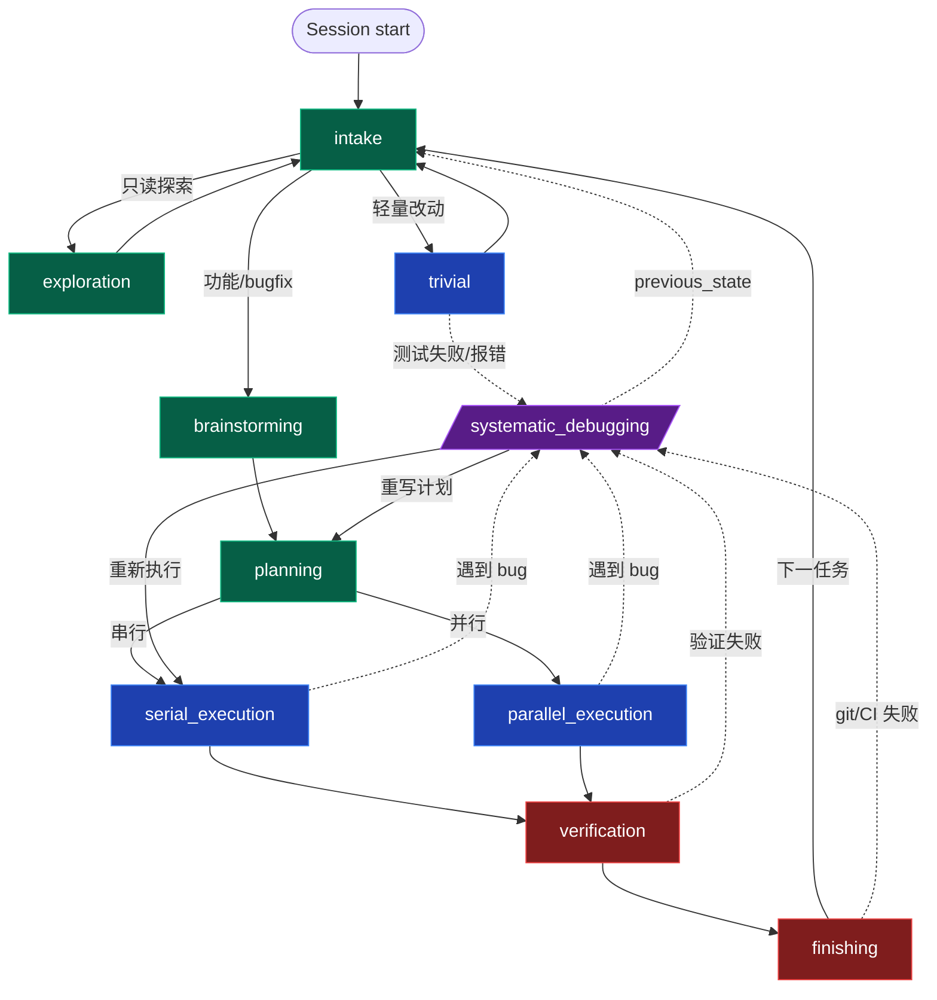

# 状态机 v3 设计：分流入口 + 轻量通道 + 命名对齐

**Status**: Pending user review
**Date**: 2026-05-19
**Author**: brainstorm session with @ShirlyTaylor73
**Reference**: [docs/human/state_machine_v3.mermaid](../../human/state_machine_v3.mermaid)

## 1. 问题陈述

当前 superharness 状态机（v1）有 4 个痛点：

1. **太笨重**：任何任务都必须走 brainstorming → planning → execution → verification → finishing 全流程，简单修改或纯问答也不例外
2. **缺多周期项目支持**：epic 级别项目无法被切分为多个开发周期（**本次不解决，defer 到 v4**）
3. **任务一视同仁**：没有难度分级和路由能力
4. **无需求分析入口**：没有专门给"和用户对齐需求 + 分流"的阶段

本次目标：解决 1、3、4，引入轻量通道和路由入口；为 2 留出扩展空间但不实现。

## 2. 设计决策记录

所有 root / middle / leaf 决策（含未采纳方案）：

| 层 | 决策 | 选项 | 选定 | 理由 |
|---|---|---|---|---|
| Root | 入口状态本质 | 真态+SKILL.md / 元态hook短路 / brainstorming兼任 | **真态+专用 SKILL.md** | 沿用现有 superharness 强约束架构；不弱化为 Trellis 那种文字约束 |
| Root | 多周期项目支持 | 实现 / 暂不实现 | **暂不实现** | YAGNI；当前痛点 1/3/4 价值更高 |
| Root | 难度判定来源 | AI自判 / 用户显式标注 / classify_request 强制 / Hook 预判 | **AI 基于 SKILL.md 自判** | 与现有"SKILL.md 软引导 + AI 主动 transition"哲学一致 |
| Root | 快速通道审计 | 全走 / 都不走 / trivial+exploration 走 / 只 trivial 走 | **trivial + exploration 切真态，answer-only 不切** | 平衡审计完整性与日志噪声 |
| Middle | intake 的 type | interactive / 新 type passive / router | **interactive** | 0 代码改动到 render-context，复用现有机制 |
| Middle | trivial 完成路径 | →intake / →verification→intake / →verification→finishing→intake | **→intake** | 保 quick path "快" 的初心 |
| Middle | verification 失败去哪 | →debug / →debug+serial 双选 / →serial | **→debug** | 与 systematic-debugging 哲学一致（不做根因不许提修复） |
| Middle | done 终态去留 | 删除 / 保留 / 作为 intake 别名 | **删除** | 一次会话可循环多任务，intake 兼任空闲态 |
| Middle | 命名对齐范围 | 只新状态 / 全部重命名 / 重命名+保留别名 | **全部重命名** | 心智负担最低 |
| Middle | execution_choice 去留 | 保留 router / 删除让 planning 直接给 AI 选 | **删除** | YAGNI——execution_choice 无 skill 只是 router 中转，planning 的 `next: [serial_execution, parallel_execution]` 直接表达可选项；省一跳、少一个 type、SKILL.md/render-context 不变 |
| Leaf | trivial 的 type | execution / interactive / 新 type fast_execution | **execution** | type 语义一致（都是写代码阶段） |
| Leaf | exploration 的 type | interactive / 新 type readonly / gate | **interactive** | exploration 是人机对话探索 |
| Leaf | 哪些状态能抢占 debug | 除 intake 外都能 / 全都能 / 只执行类 | **执行类 + finishing**（serial/parallel/verification/trivial/finishing） | 抽象成 "接触实际制品/外部系统的状态"；finishing 因 git/CI 失败场景显式加入 |
| Leaf | debug.next 是否扩充 | 不变 / 加 intake / 加 trivial | **保持 [previous_state, serial_execution, planning]** | previous_state 已能覆盖所有来源，加边只增决策复杂度 |

## 3. 状态机骨架

### 3.1 状态清单（10 个）

| 状态 | type | 绑定 skill | 备注 |
|---|---|---|---|
| `intake` ⭐新 | interactive | `intake` | **新入口**。triage + answer-only 兜底 |
| `exploration` ⭐新 | interactive | `exploration` | 只读长会话 |
| `trivial` ⭐新 | execution | `trivial` | 轻量改 + 自带验证 |
| `brainstorming` | interactive | `brainstorming` | 不变 |
| `planning` | interactive | `planning`（改自 writing-plans） | 重命名 + next 直接给 serial/parallel |
| `serial_execution` | execution | `serial-execution`（改自 serial-executing-plans） | 重命名 |
| `parallel_execution` | execution | `parallel-execution`（改自 parallel-executing-plans） | 重命名 |
| `verification` | gate | `verification`（改自 verification-before-completion） | 重命名 |
| `finishing` | gate | `finishing`（改自 finishing-a-development-branch） | 重命名 |
| `systematic_debugging` | preemptive | `systematic-debugging` | next 不变；SKILL.md 增章节 |

**元数据：**
- `entryState`: `brainstorming` → **`intake`**
- `terminalStates`: `[done]` → **`[]`**（空数组，一次会话可循环多任务）
- 删除状态：`done`, `execution_choice`

### 3.2 转换表（20 条边）

| 状态 | next |
|---|---|
| `intake` | `[exploration, trivial, brainstorming]` |
| `exploration` | `[intake]` |
| `trivial` | `[intake, systematic_debugging]` |
| `brainstorming` | `[planning]` |
| `planning` | `[serial_execution, parallel_execution]` |
| `serial_execution` | `[verification, systematic_debugging]` |
| `parallel_execution` | `[verification, systematic_debugging]` |
| `verification` | `[finishing, systematic_debugging]` |
| `finishing` | `[intake, systematic_debugging]` |
| `systematic_debugging` | `[previous_state, serial_execution, planning]` |

**抢占规则**：可转 `systematic_debugging` 的状态 = 接触实际制品/外部系统的状态（`serial_execution` / `parallel_execution` / `verification` / `trivial` / `finishing`）。其余对话态不能抢占。

### 3.3 流程图



## 4. SKILL.md 内容大纲

### 4.1 `intake` skill（新建）

**角色**：会话起点 + 任务完成后的默认态。三件事：听需求、必要时澄清、路由到下一状态。

**决策表**：

| 用户意图 | 走 | transition_state 到 |
|---|---|---|
| 纯问答 / 解释 / 查 API 用法 | 当场答 | **不切态** |
| 看看 X 是怎么实现的 / 深度探索 | 进入只读探索 | `exploration` |
| 改个 typo / 调整配置 / 单文件小修复 | 进入快速改动 | `trivial` |
| 新功能 / bugfix / 多文件变更 | 进入正式开发 | `brainstorming` |

**反过度分类**：
- 用户问问题就答，不要为了"走流程"硬切态
- 不确定大小时回问一句确认

**transition reason 要求**：包含用户原话摘要 + 判定理由。

### 4.2 `exploration` skill（新建）

**角色**：只读深度探索（理解代码、对比方案、做调研）。**不写代码**。

**工具白名单**：
- ✓ Read / Grep / Glob / WebFetch / WebSearch / Bash 只读命令
- ✗ Edit / Write / git commit / 任何修改

**输出规范**：结构化分析报告，引用 `file_path:line_number`。

**完成后**：
- 用户问完 / 满足 → `intake`
- 用户改主意要改代码 → `intake`（让 intake 重新路由，**不直接跳** trivial / brainstorming）

### 4.3 `trivial` skill（新建）

**角色**：单点小改 + 自带验证。**不走 plan/verification**。

**改动边界**：
- ≤ 3 个文件
- ≤ 50 行实质改动
- 不引入新依赖、不改公共 API、不改 schema

超出 → 立刻 transition 回 `intake`，让用户决定升级到 `brainstorming`。

**自带验证**：改完必须跑相关 test + lint + 类型检查。

**异常出口**：
- 测试失败 / 报错 → `systematic_debugging`
- 发现改动范围超预期 → `intake`

**完成后**：transition 回 `intake`，reason 写明"改了什么 + 验证结果"。

### 4.4 `systematic-debugging` skill 补丁

在末尾新增章节：

```markdown
## 完成调试后

调试完成 ≠ 任务完成。根据情况选择下一步：

### 默认：previous_state（回到抢占来时态）
**最常用**。bug 已修、测试通过、调用方逻辑未变 → previous_state 把你送回抢占进来的那个状态继续推进。

### serial_execution（直接重跑串行实施）
当：调试期间发现实施层面的具体问题（如某段代码逻辑错），修了之后直接重跑实施即可，**不需要重新规划**。

### planning（回到写计划）
当：调试过程中获得的新信息**推翻了原计划**——比如发现架构不对、需要换库、范围要变。此时不能继续旧计划，必须重写。

### 决策示意
| 情况 | 选 |
|---|---|
| 改了几行代码就过测试了 | previous_state |
| 改了一个函数实现，原计划没变 | previous_state 或 serial_execution |
| 调试发现原方案根本走不通 | planning |
| 调试 3 次以上都没修好 | 见"质疑架构"，可能也要 planning 重设计 |

reason 必须明确写出**选这条路的理由**（落审计）。
```

## 5. 实施影响清单

### 5.1 文件变更

| 文件 / 目录 | 动作 |
|---|---|
| `plugins/superharness/workflow/default-workflow.yaml` | 改 entryState、terminalStates、删 done 和 execution_choice、改 planning.next（直接给 serial/parallel）、改 finishing.next、删 brainstorming/planning 的 debug 边、新增 intake/exploration/trivial 三状态、所有 `skill:` 字段换裸名 |
| `plugins/superharness/skills/writing-plans/` | 重命名 → `planning/`（含 SKILL.md frontmatter `name`） |
| `plugins/superharness/skills/serial-executing-plans/` | 重命名 → `serial-execution/` |
| `plugins/superharness/skills/parallel-executing-plans/` | 重命名 → `parallel-execution/` |
| `plugins/superharness/skills/verification-before-completion/` | 重命名 → `verification/` |
| `plugins/superharness/skills/finishing-a-development-branch/` | 重命名 → `finishing/` |
| `plugins/superharness/skills/intake/SKILL.md` | **新建** |
| `plugins/superharness/skills/exploration/SKILL.md` | **新建** |
| `plugins/superharness/skills/trivial/SKILL.md` | **新建** |
| `plugins/superharness/skills/systematic-debugging/SKILL.md` | 末尾追加"完成调试后"章节 |
| `plugins/superharness/skills/brainstorming/SKILL.md` | "调用 writing-plans" 改为 "transition 到 planning" |
| `plugins/superharness/workflow-state-server/test/server.test.js` | 测试 fixture 全量更新 |
| `plugins/superharness/workflow-state-server/test/state.test.js` | 同上 |
| `plugins/superharness/workflow-state-server/test/validate-workflow.test.js` | 同上 |
| `plugins/superharness/workflow-state-server/test/render-context.test.js` | 同上 |
| `plugins/superharness/workflow-state-server/validate-workflow.js` | 新增硬约束："intake 必须存在且为 entryState" |
| `plugins/superharness/workflow-state-server/state.js` | `initializeWorkflowState` 加 legacy state migrator |

### 5.2 数据库兼容性

工作区里已有 `.superharness/workflow-state.db` 的用户：

| 已有 state | 处理 |
|---|---|
| `brainstorming` / `planning` / `serial_execution` / `parallel_execution` / `verification` / `finishing` / `systematic_debugging` | 保留（这些状态没删，next 变化不影响当前态读取） |
| `done`（已删除） | **自动迁移**到 `intake` + transition_log 记 `done → intake (legacy migration)` 事件 |
| `execution_choice`（已删除） | **自动迁移**到 `planning`（用户当时正要选执行模式，回 planning 让 AI 重新决定）+ transition_log 记 `execution_choice → planning (legacy migration)` 事件 |
| 其他未知 state | 兜底转 `intake`，记 migration 事件 |

迁移逻辑位置：[state.js](../../../plugins/superharness/workflow-state-server/state.js) 的 `initializeWorkflowState` / `getOrInitState`。

### 5.3 validate-workflow.js 硬约束变化

| 约束 | 状态 |
|---|---|
| `systematic_debugging.next` 必须含 `previous_state` | 保留 |
| `entryState` 必须存在于 `states` | 保留 |
| `terminalStates` 引用必须存在 | 保留（空数组合法） |
| 终态不得有 skill/next | 保留 |
| **`intake` 必须存在且 = entryState** | **新增** |

### 5.4 测试 / 验证清单

- [ ] `npm test`（workflow-state-server 单元测试）全绿
- [ ] 新增 transition 合法性测试：
  - `intake → exploration` 允许
  - `intake → trivial` 允许
  - `intake → brainstorming` 允许
  - `trivial → systematic_debugging` 允许
  - `planning → serial_execution` 允许
  - `planning → parallel_execution` 允许
  - `brainstorming → systematic_debugging` **拒绝**
  - `planning → systematic_debugging` **拒绝**
  - `finishing → intake` 允许
- [ ] 迁移测试：构造 db with `state='done'`，初始化后断言变成 `intake` + transition_log 多了一条 legacy migration
- [ ] render-context 测试：注入 intake/exploration/trivial 时 SKILL.md 正确取出
- [ ] **YAML 一致性测试（修历史遗留 fixture drift gap）**：新增测试用 `loadWorkflowConfig` 读真 YAML，断言与硬编码 fixture 等价
- [ ] OpenCode 插件契约测试 (`tests/opencode/run-tests.sh`) 全绿
- [ ] Skill triggering 测试（`tests/skill-triggering/`）：新加 intake/exploration/trivial 的触发场景

## 6. 范围外（明确 defer）

以下功能本次**不实现**：

- 多周期 epic 项目（project_planning / project_integration / feature 队列存储）
- sub-agent 执行模型（Trellis 风格的隔离子代理）
- check skill 自修复回路
- journal / record-session 跨会话日志

## 7. 风险与缓解

| 风险 | 缓解 |
|---|---|
| **批量重命名导致引用断裂**：5 个 skill 目录改名，多处交叉引用可能漏改 | 全文 grep 旧名（writing-plans / verification-before-completion 等）作为最终检查；测试覆盖 |
| **legacy state migrator 在并发场景下出问题** | 迁移逻辑放在 `getOrInitState` 内的事务里，复用现有 SQLite 事务 |
| **intake skill 过度路由**：AI 把所有问题都当 brainstorming 处理 | SKILL.md 显式加 "反过度分类" 章节；transition reason 审计可后验 |
| **trivial 边界（3 文件/50 行）太严或太松** | 数字写入 SKILL.md 但保留 "AI 判断 + 必要时升级到 brainstorming" 兜底；运行 1-2 周后根据 transition_log 调参 |
| **存量 skill 引用其他 skill 旧名**（如 systematic-debugging 引用 verification-before-completion） | grep 检查每个 skill 内的文本引用，更新到新名 |

## 8. 成功标准

实施完成后应满足：
- [ ] 新会话默认进入 `intake`，不自动走 brainstorming 流程
- [ ] 用户问 "今天天气怎么样" 这种纯问答时 AI 不切态（不产生 transition_log）
- [ ] 用户说 "改个 typo" 类任务 AI 进入 trivial，不走 brainstorming/planning
- [ ] 用户说 "新功能 X" 类任务 AI 进入 brainstorming，沿标准 cycle 推进
- [ ] 标准 cycle 完成后回到 intake（不停在 done）
- [ ] systematic_debugging 完成后 AI 能正确选择 previous_state / planning / serial_execution
- [ ] 旧 db 中 `state='done'` 的用户自动迁移到 intake 无报错
- [ ] 5 个被重命名 skill 在新名字下被状态机正确激活
